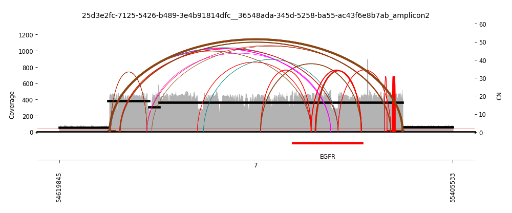

*MDM2* Amplification in ecDNA

Investigation of the role of the *MDM2* oncogene in cancer, particularly in the context of extrachromosomal DNA (ecDNA) amplification.

Using public resources such as BLAST, NCBI, UCSC Genome Browser, and the Amplicon Repository database, we characterized *MDM2*'s evolutionary history, the distribution of its ecDNA amplification in adult vs. pediatric tumors, its co-occurence with other prominent oncogenes, and the structural variant (SV) types of amplicons containing *MDM2*. 

To identify SVs, we analyzed discordant edges extracted from amplicon graphs in the Amplicon Repository using computational approaches involving Unix and Python.

Final project completed in Spring 2025 for UC San Diego's *Biological Databases (BIMM 182)* course.
